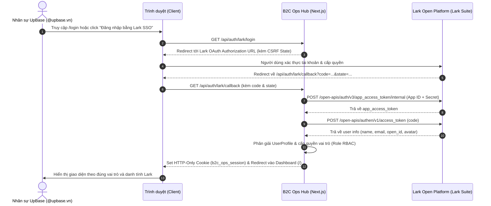

# HƯỚNG DẪN TÍCH HỢP & VẬN HÀNH LARK SSO — B2C OPS HUB

| Thuộc tính | Giá trị |
| --- | --- |
| Mã tài liệu | HUB-TECH-01 |
| Tính năng | Đăng nhập tập trung Lark SSO (OAuth 2.0) |
| Liên quan | OI-005 (Identity Provider dùng chung) |
| Cập nhật | 07/10/2026 |

---

## 1. Luồng Xác thực (OAuth 2.0 Flow)



---

## 2. Các Bước Cấu hình App trên Lark Developer Console

Để kích hoạt đăng nhập thật từ tổ chức UpBase, quản trị viên thực hiện các bước sau:

1. **Truy cập Lark Developer Console:**
   - Đăng nhập: [https://open.larksuite.com/](https://open.larksuite.com/) bằng tài khoản admin công ty UpBase.
2. **Tạo Custom App mới:**
   - Nhấn **Create Custom App** -> Đặt tên: `UpBase B2C Ops Hub`.
   - Mô tả: *Hệ thống quản trị và điều hành phòng Marketing B2C*.
3. **Cấu hình Redirect URL (Bảo mật callback):**
   - Vào menu bên trái: **Security Settings** -> **Redirect URLs**.
   - Thêm URL:
     - Môi trường Local: `http://localhost:3000/api/auth/lark/callback`
     - Môi trường Staging/Prod: `https://[DOMAIN_CỦA_BẠN]/api/auth/lark/callback`
4. **Cấp quyền truy cập thông tin nhân sự (Scopes):**
   - Vào **Permissions & Scopes** -> Chọn các quyền:
     - `contact:user.base:readonly` (Lấy thông tin cơ bản: tên, open_id, avatar).
     - `contact:user.email:readonly` (Lấy email doanh nghiệp @upbase.vn).
5. **Lấy App ID và App Secret:**
   - Vào mục **Credentials & Basic Info**.
   - Copy `App ID` (dạng `cli_xxxxxxxxxxxxx`) và `App Secret`.
6. **Điền vào file `.env.local` của dự án:**
   ```env
   LARK_APP_ID=cli_xxxxxxxxxxxxxx
   LARK_APP_SECRET=xxxxxxxxxxxxxxxxxxxxxxxxxxxxxxxx
   LARK_DOMAIN=open.larksuite.com
   LARK_REDIRECT_URI=http://localhost:3000/api/auth/lark/callback
   ```
7. **Phát hành phiên bản (App Version):**
   - Vào **Version Management & Release** -> Tạo version (vd `1.0.0`) và nhấn Submit for Approval để Lark Admin duyệt cho toàn bộ nhân sự UpBase sử dụng.

---

## 3. Chế độ Thử nghiệm Nhanh (Sandbox / Mock Mode)

Trong thời gian chờ Lark Admin cấp App ID chính thức hoặc khi phát triển offline:
* Hệ thống đã tích hợp sẵn **Sandbox Persona Switcher** tại trang `/login`.
* Bạn có thể chọn nhanh các nhân sự cốt lõi:
  * **Vân Ngọc** — Trưởng phòng (Manager Role).
  * **Đặng Mai Hà Linh** — Brand PIC / Senior Campaign Lead.
  * **Khánh Vy** — Senior Booking Execution Specialist.
  * **Ngỳnh Như** — Content & Script Lead.
* Nhấn **"Đăng nhập thử với nhân sự đã chọn"** để vào hệ thống ngay lập tức với token session chuẩn mà không cần nhập mật khẩu.
